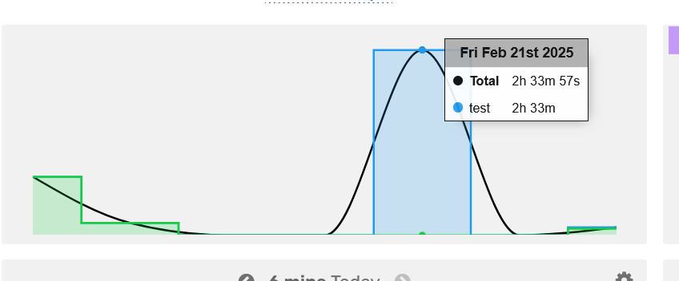
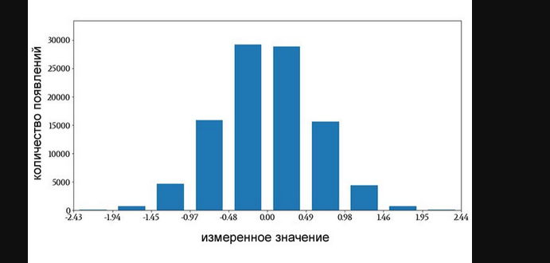
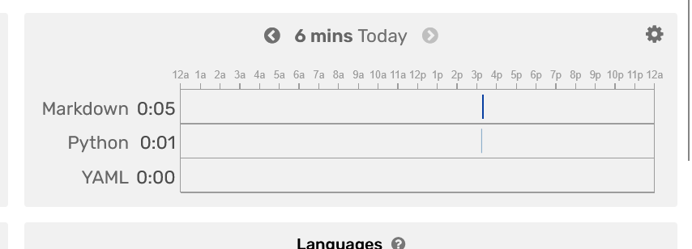

Короче, настал тот самый день, когда я наконец допилю все графики.

Что за сегодня нужно сделать?
1. **Протестировать обновленную команду show_statistic.**
Ранее я добавил к ней три новых параметра, которые позволили бы менять временной диапазон. Хочу убелиться в их работоспособности
2. **Выстроить все графики.**

3. **Переделать параметры для show_statistic.**
Щас понимаю, что я гой, потому что тики на графиках были через каждый час для всех графиков, хотя в wakatime они были через только для графиков за одни сутки. Короче надо оставить тики через час для графиков с отображающих отрезок не более чем на сутки, для остальных графиков желательно поставить тики через каждый день.
Вернее даже так:
суточныую и почасовую статистику показывать либо на отдельных гистограммах или, либо на обычной гистограмме.
О подневные или понедельные графики через накладываемые гистограммы через каждый день.
4. **Добавить параметр типа графика для функции show_statistic**

